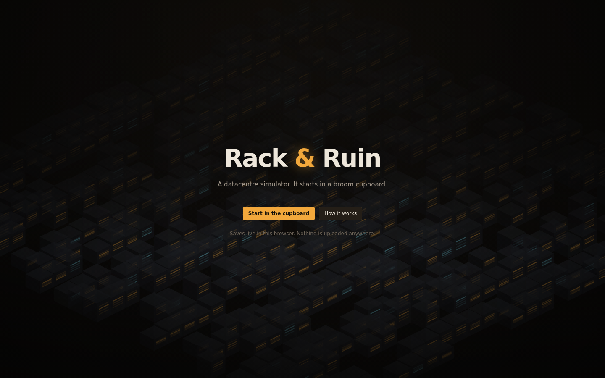
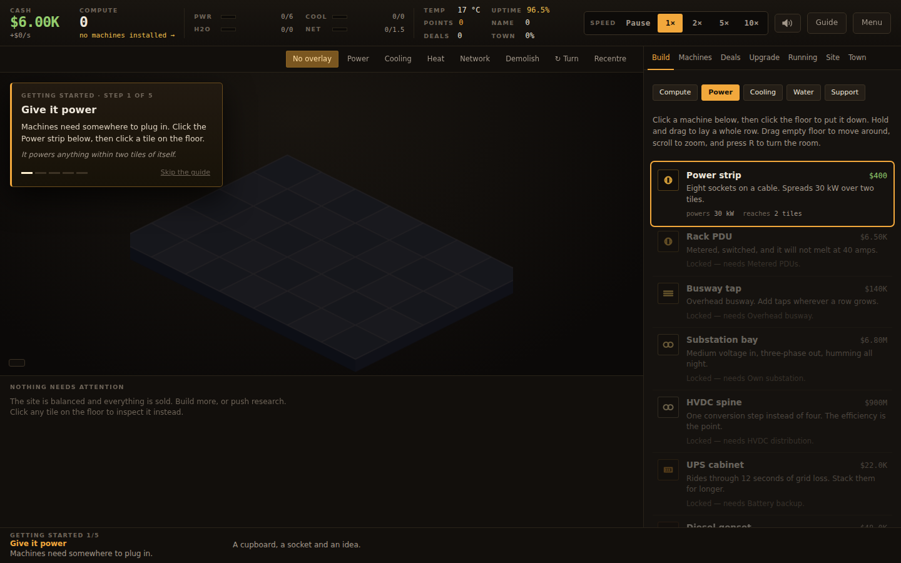
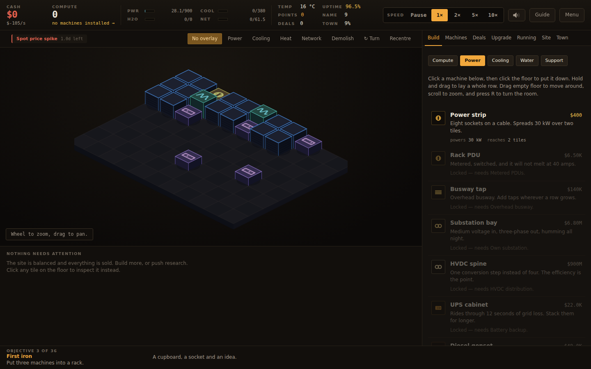
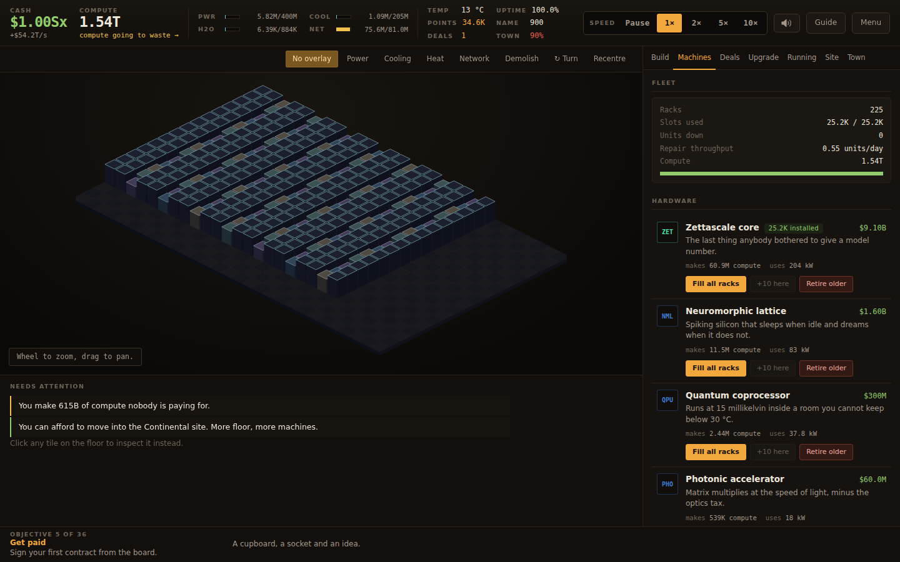
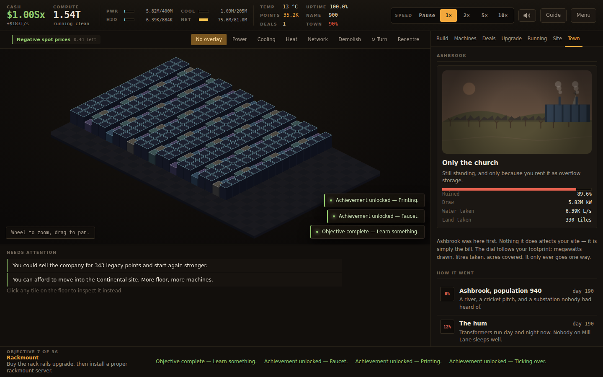

# Rack &amp; Ruin

An incremental datacentre simulator that runs entirely in a browser. You start
in a broom cupboard with one wall socket and a salvaged desktop. If you get it
right you finish on a continental site with fusion on the fence line and a
zettascale fleet on the floor.

No build step, no server, no dependencies. Open it and play.

```
python3 -m http.server 8000
# then open http://localhost:8000
```



It is built for a desktop or tablet screen — the floor plan wants room. It
runs on a phone, but you will spend a lot of time panning.

(A plain `file://` open will not work — the game is written as ES modules, and
browsers refuse to load modules from the filesystem. Any static server does.)



## The first five minutes

A new game opens with a five-step guide. Each step names one thing to do,
switches to the tab that does it, and puts a ring around the exact control —
then completes itself when the game state says you did it.

1. **Give it power.** Place a power strip. Nothing runs without one in reach.
2. **Somewhere to put servers.** Place a rack inside the strip's two tiles.
3. **Move the heat.** A box fan, before you fill the rack rather than after.
4. **Fill it with iron.** One button buys as much as cash and power allow.
5. **Now get paid.** Sign a contract that fits inside your spare capacity.

That is the entire game in miniature. Skip it from the card, or start it again
from Menu → Run the guide again. The **Guide** button in the top bar explains
every number and every colour on screen at any point after that.



## The idea

Compute is easy to buy and hard to run. Every unit you rack up needs

- **electricity**, both a local distribution path and site-wide supply,
- **cooling**, which only reaches racks inside its radius,
- **water**, which the cooling drinks and a drought can take away,
- **switching**, or the compute may as well not exist,
- **maintenance**, because condition decays and heat makes it decay faster,

and none of it earns a penny until the compute is under contract. Contracts
carry an SLA. Miss it and you pay a penalty and lose reputation, and
reputation is what unlocks the next building and the contracts worth having.

That is the whole loop, and it stays the whole loop from the cupboard to the
campus. Only the numbers and the machinery change.



## What is in it

| | |
|---|---|
| Facility tiers | 10, from a 7×5 cupboard to a 33×20 site |
| Placeable machines | 40 — racks, PDUs, cooling, generation, water, switching, support |
| Hardware generations | 12, from a salvaged desktop to a zettascale core |
| Research nodes | 87 across seven branches |
| Cash upgrades | 32 permanent purchases |
| Contract types | 18, gated behind your name, each with a few possible clients |
| Random events | 20, seven of which stop and ask you a question |
| Machine icons | 32 hand-drawn glyphs, on the floor and in the build list |
| The town next door | Ashbrook, in nine stages, from cricket pitch to nothing |
| Objectives | 35, in a guided chain |
| Achievements | 36 |
| Legacy perks | 15, bought with the points from selling the company |

A full run to the end of the research tree is a long evening — roughly five
hours, less if you are ruthless with your floor plan.



## Playing

Place a power strip, a rack and a box fan. Put hardware in the rack. Sign a
contract off the board. From there it is a balancing act:

- **The strip under the floor is a to-do list.** With no tile selected it
  names every fixable problem — racks with no PDU in range, compute sitting
  unsold, research you can afford — worst first. Click a row and it takes you
  to the tab that fixes it, with the right overlay already on.
- **Contracts arrive continuously**, roughly a couple of offers a day, each
  good for about a week. There is no limit on how many you run at once — the
  only thing stopping you is spare compute. Promise more than you produce and
  you start paying fines.
- **The top bar tells you what is wrong.** The Compute tile names the current
  bottleneck in plain words — *short of electricity*, *cooling is behind*,
  *compute is unsold* — and clicking it takes you to the tab that fixes it.
  Every other tile explains itself on hover.
- **Speed control.** A labelled `Pause 1× 2× 5× 10×` control in the top bar, or
  `+` and `−` on the keyboard. A day is a minute at 1×, six seconds at 10×.
- **Hovering picks the machine, not the ground under it.** On an isometric
  floor a rack is drawn well above the tile it stands on, so the outline goes
  round the machine itself and it lifts slightly. Pointing at something and
  having the highlight appear at its feet is the single most confusing thing an
  isometric view can do.
- **Ashbrook.** The village next door. It does nothing to you; it is the bill.
  The dial follows your footprint — megawatts, litres, acres — and only ever
  goes one way. Ruining it completely is the other thing to aim at.
- **Buy floor.** Extra rows and columns on the Site tab, on top of whatever
  footprint your facility came with, and they carry over when you move.
- **The floor is isometric.** Machines stand on it as real volumes: racks are
  steel cabinets whose lit server bays show how full and how healthy they are,
  and a rack grows taller as you fill it. Everything else is identified by its
  silhouette, its height and the glyph on its top face — hover to name it.
- **Turn the room** with `R` when a tall machine is hiding what is behind it.
- **Racks flag their own problems.** An amber triangle means no PDU reaches
  this rack; a red one means no cooling does, or it is over 40 °C. You do not
  need an overlay on to see them.
- **The overlay buttons** above the floor are the fastest diagnosis you have.
  *Power* and *Cooling* shade the tiles each machine reaches; a rack nothing
  reaches gets red hatching. *Heat* colours every rack by temperature.
- **Radius matters.** A CRAC unit four tiles away does nothing for a rack five
  tiles away. Rows of racks with a service aisle beat scattered ones.
- **The utility will only sell a site so much power.** The cap rises with the
  facility tier. Past that you generate it yourself, and generators occupy
  floor you would rather fill with racks.
- **Research allocation** (the slider on the R&D tab) diverts a share of your
  compute away from contracts. Early on it is the only research you have;
  later a few percent is plenty.
- **Heat kills slowly.** Above about 30 °C hardware throttles; above 40 °C it
  wears out fast and starts failing. Technicians and workshops repair, but
  repair effort is shared across all your racks, so a bigger site needs more
  of it just to stand still.

Keyboard: `1`–`9` switch tabs, `O` cycles overlays, `Space` pauses, `Esc`
clears the current tool. Wheel zooms, dragging pans, and dragging with a
machine selected places a whole row.

## Starting again

Once you reach Data hall A you can sell the company. You get legacy points for
what you built, and start over in the cupboard with nothing — except the
points, the fifteen permanent perks they buy, and your achievements. Perks
compound: more compute per machine, cheaper hardware, more slots per rack, a
tier of head start. The second run goes further than the first, and the fourth
goes further still.

## Saving

The game autosaves to `localStorage` every fifteen seconds and gives you
offline progress when you come back (capped by research and legacy perks, and
deliberately gentle — nothing breaks while you are away). Menu → Export hands
you a save string; Import takes one back. Nothing is uploaded anywhere.

## The look

Night shift in a control room: warm charcoal, bone type, amber for anything
that wants your attention, and a cold cyan kept strictly for the cold side of
the plant — cooling and water. Rules and spacing separate things rather than a
border round everything. Numbers are tabular mono so they stop jittering, and
they roll to a new value rather than snapping, which keeps a large number
readable while it changes.

The floor takes a lighting wash from the clock — cold after dark, warm at dawn
and dusk — and rack LEDs brighten as the room darkens. Racks running hot give
off a shimmer, towers and the recycler steam, machines land in a puff of dust
and leave as debris. All of it is budgeted and tied to zoom, so a full site
pays nothing for any of it.

There is sound: a room tone that scales with the draw of the site, and a short
cue for the few moments worth hearing. It never starts before you click, and
the speaker button in the top bar or the `M` key turns it off.

## Layout

```
index.html          the shell
styles/main.css     all styling
src/
  main.js           boot, the game loop, modals, offline progress
  state.js          state shape, save/load, migration
  sim.js            modifiers, the derived snapshot, the tick
  actions.js        everything the player can do, with its cost checks
  render.js         canvas floor view, overlays, pan and zoom
  ui.js             every panel
  town.js           Ashbrook, and how far gone it is
  audio.js          room tone and cues, synthesised — no audio files
  bootart.js        the server hall behind the title card
  tip.js            the single floating tooltip
  data/
    hardware.js     what goes in a rack
    buildings.js    what goes on the floor
    research.js     the tree
    contracts.js    contract templates
    events.js       random events and decisions
    progression.js  facilities, staff, upgrades, objectives, achievements, legacy
src/tutorial.js     the five-step guided opening
tools/
  balance.mjs       headless economy probe
  bot.mjs           an automated player, used to check pacing over a long run
  browser-check.mjs sixteen end-to-end checks in a real browser
  shots.mjs         regenerates every screenshot in docs/
```

`sim.js` is the only file that decides anything. `derive(state)` builds a
complete picture of the site from scratch every tick — coverage, temperature,
throttling, revenue, costs — and `tick(state, dt, derived)` applies it. The UI
never computes; it only reads that snapshot.

## Tuning it yourself

Every number that matters lives in `src/data/`. If you want a harsher game,
raise `wear` on the hardware or drop the `gridCap` on the facilities. If you
want a faster one, raise the market price in `state.js`.

To check what a change does to a five-hour run without playing five hours:

```
node tools/bot.mjs      # a full five-hour run, in about ninety seconds
node tools/balance.mjs  # the first ten minutes, in detail
```

And to check nothing is broken in an actual browser — the guided opening, every
tab and overlay, drag-building, a 660-tile endgame floor, the save round trip
and the narrow-screen layout:

```
python3 -m http.server 8099 &
node tools/browser-check.mjs
```

It needs Playwright. If it is installed globally rather than locally, point
`RR_PLAYWRIGHT` at it and `RR_CHROMIUM` at a browser binary.

The screenshots in this README are generated the same way, so they cannot
drift from the game:

```
node tools/shots.mjs
```

A healthy run has the bot reaching facility tier 7–9 and finishing the
research tree somewhere around the two-and-a-half hour mark. If it stalls at
one tier for an hour, something in the ladder is out of step.

It plays the game with a crude strategy and prints a milestone line every ten
simulated minutes.

## Licence

MIT. See `LICENSE`.
