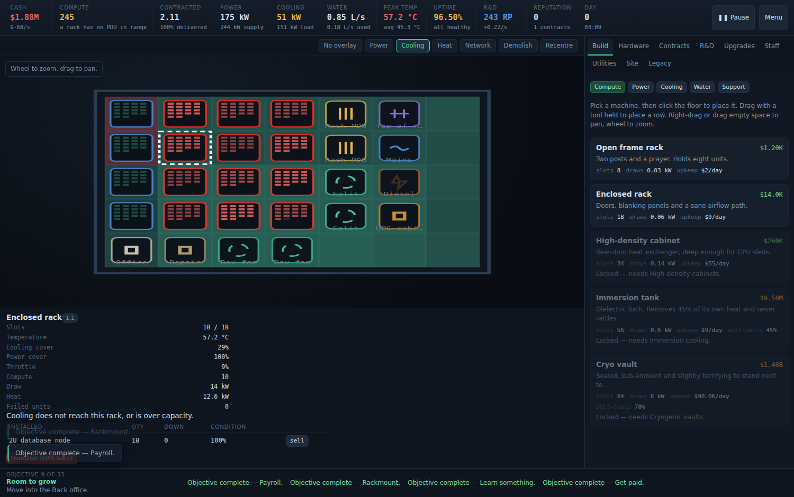

# Rack &amp; Ruin

An incremental datacentre simulator that runs entirely in a browser. You start
in a broom cupboard with one wall socket and a salvaged desktop. If you get it
right you finish on a continental site with fusion on the fence line and a
zettascale fleet on the floor.

No build step, no server, no dependencies. Open it and play.

```
python3 -m http.server 8000
# then open http://localhost:8000
```

It is built for a desktop or tablet screen — the floor plan wants room. It
runs on a phone, but you will spend a lot of time panning.

(A plain `file://` open will not work — the game is written as ES modules, and
browsers refuse to load modules from the filesystem. Any static server does.)



## The idea

Compute is easy to buy and hard to run. Every unit you rack up needs

- **electricity**, both a local distribution path and site-wide supply,
- **cooling**, which only reaches racks inside its radius,
- **water**, which the cooling drinks and a drought can take away,
- **switching**, or the compute may as well not exist,
- **maintenance**, because condition decays and heat makes it decay faster,

and none of it earns a penny until the compute is under contract. Contracts
carry an SLA. Miss it and you pay a penalty and lose reputation, and
reputation is what unlocks the next building and the contracts worth having.

That is the whole loop, and it stays the whole loop from the cupboard to the
campus. Only the numbers and the machinery change.


## What is in it

| | |
|---|---|
| Facility tiers | 10, from a 7×5 cupboard to a 33×20 site |
| Placeable machines | 40 — racks, PDUs, cooling, generation, water, switching, support |
| Hardware generations | 12, from a salvaged desktop to a zettascale core |
| Research nodes | 87 across seven branches |
| Cash upgrades | 32 permanent purchases |
| Contract types | 18, gated behind reputation |
| Random events | 20, seven of which stop and ask you a question |
| Objectives | 35, in a guided chain |
| Achievements | 36 |
| Legacy perks | 15, bought with the points from selling the company |

A full run to the end of the research tree is a long evening — roughly five
hours, less if you are ruthless with your floor plan.

## Playing

Place a power strip, a rack and a box fan. Put hardware in the rack. Sign a
contract off the board. From there it is a balancing act:

- **The overlay buttons** above the floor are the fastest diagnosis you have.
  *Power* and *Cooling* shade the tiles each machine reaches; a rack nothing
  reaches gets red hatching. *Heat* colours every rack by temperature.
- **Radius matters.** A CRAC unit four tiles away does nothing for a rack five
  tiles away. Rows of racks with a service aisle beat scattered ones.
- **The utility will only sell a site so much power.** The cap rises with the
  facility tier. Past that you generate it yourself, and generators occupy
  floor you would rather fill with racks.
- **Research allocation** (the slider on the R&D tab) diverts a share of your
  compute away from contracts. Early on it is the only research you have;
  later a few percent is plenty.
- **Heat kills slowly.** Above about 30 °C hardware throttles; above 40 °C it
  wears out fast and starts failing. Technicians and workshops repair, but
  repair effort is shared across all your racks, so a bigger site needs more
  of it just to stand still.

Keyboard: `1`–`9` switch tabs, `O` cycles overlays, `Space` pauses, `Esc`
clears the current tool. Wheel zooms, dragging pans, and dragging with a
machine selected places a whole row.

## Saving

The game autosaves to `localStorage` every fifteen seconds and gives you
offline progress when you come back (capped by research and legacy perks, and
deliberately gentle — nothing breaks while you are away). Menu → Export hands
you a save string; Import takes one back. Nothing is uploaded anywhere.

## Layout

```
index.html          the shell
styles/main.css     all styling
src/
  main.js           boot, the game loop, modals, offline progress
  state.js          state shape, save/load, migration
  sim.js            modifiers, the derived snapshot, the tick
  actions.js        everything the player can do, with its cost checks
  render.js         canvas floor view, overlays, pan and zoom
  ui.js             every panel
  data/
    hardware.js     what goes in a rack
    buildings.js    what goes on the floor
    research.js     the tree
    contracts.js    contract templates
    events.js       random events and decisions
    progression.js  facilities, staff, upgrades, objectives, achievements, legacy
tools/
  balance.mjs       headless economy probe
  bot.mjs           an automated player, used to check pacing over a long run
```

`sim.js` is the only file that decides anything. `derive(state)` builds a
complete picture of the site from scratch every tick — coverage, temperature,
throttling, revenue, costs — and `tick(state, dt, derived)` applies it. The UI
never computes; it only reads that snapshot.

## Tuning it yourself

Every number that matters lives in `src/data/`. If you want a harsher game,
raise `wear` on the hardware or drop the `gridCap` on the facilities. If you
want a faster one, raise the market price in `state.js`.

To check what a change does to a five-hour run without playing five hours:

```
node tools/bot.mjs      # a full five-hour run, in about ninety seconds
node tools/balance.mjs  # the first ten minutes, in detail
```

A healthy run has the bot reaching facility tier 7–9 and finishing the
research tree somewhere around the two-and-a-half hour mark. If it stalls at
one tier for an hour, something in the ladder is out of step.

It plays the game with a crude strategy and prints a milestone line every ten
simulated minutes.

## Licence

MIT. See `LICENSE`.
